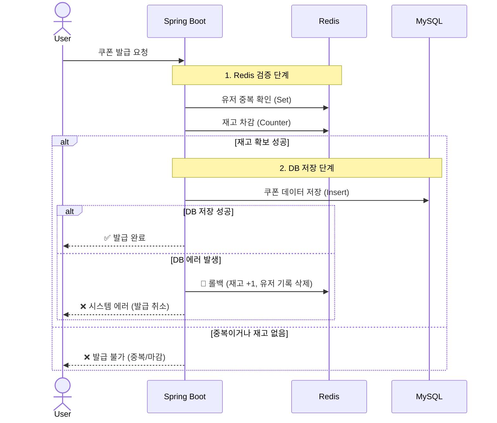
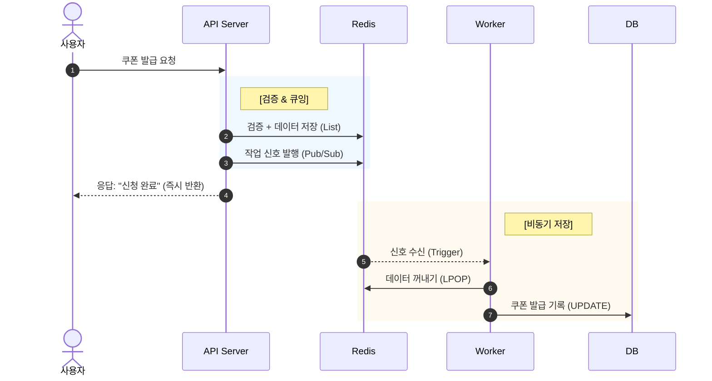

# 1. 시나리오 설계 (Business Logic)

서비스의 목표는 "정해진 시간에 한정된 수량의 쿠폰을 선착순으로 발급"하는 것입니다.

1.  **이벤트 오픈 전:** 사용자는 쿠폰 발급 요청을 보낼 수 없거나, 요청 시 "준비 중" 메시지를 받습니다.
2.  **이벤트 시작:** 수만 명 이상의 사용자가 동시에 발급 버튼을 클릭합니다.
3.  **검증 로직:**
    * 사용자가 이미 발급받았는지 확인합니다. (1인 1매 제한)
    * 남은 쿠폰 수량이 있는지 확인합니다.
4.  **발급 처리:**
    * 검증 통과 시, 사용자에게 즉시 "발급 신청이 완료되었습니다"라고 응답합니다. (Non-blocking)
    * 실제 DB 적재는 비동기로 처리됩니다.
5.  **이벤트 종료:** 수량이 소진되면 이후 요청은 즉시 "마감되었습니다"라고 거절합니다.


# 2. 아키텍처 구조

- [ ] 프로젝트 완성 후 작성 예정

### 3. 기술 스택 및 사용 이유

| 기술 스택 | 역할 | 사용 이유 및 핵심 가치                                                |
| :--- | :--- |:-------------------------------------------------------------|
| **Kotlin & Spring Boot** | 웹 프레임워크 | 간결한 문법, Null Safety로 안정성 확보, 방대한 생태계 지원.                     |
| **MySQL** | RDBMS | 데이터의 영속성 보장. 최종적인 쿠폰 발급 이력 저장.                               |
| **Spring Data JPA** | ORM | 객체 지향적인 데이터 접근, 비즈니스 로직 구현 용이.                               |

### 4. 주요 고려 사항

1.  **동시성 제어**
    * 수천 명이 동시에 요청할 때 정확히 100개만 발급되어야 한다.
2.  **중복 발급 방지**
    * 사용자 필터링을 위해 User ID를 Key로 하여 중복 여부를 체크해야 한다.


## 5. 해결 과정
### 순정 MySQL 사용
Spring Boot와 MySQL만을 사용하여 동시성 테스트를 진행해보려고 한다.
쿠폰 생성 수가 100을 넘게되면(100명에게 쿠폰이 발급되면), 쿠폰을 더 이상 발급하지 않도록 Service를 작성했다.
이 경우 1000명의 사용자가 쿠폰 발급을 동시에 수행할 경, 어떻게 될까?


당연히 100장이 아닌 107장이라는 결과가 발생했다.
이를 경쟁 상태라고 하며, 특히 'Check-Then-Act' 패턴의 한계 때문에 발생한다.
예를 들어 99장의 쿠폰이 발급된 상황에 2명의 사용자 A, B가 발생한다고 가정해보자.
A가 Check를 하여 마지막 한 장의 쿠폰이 남았다는 것을 확인하고 쿠폰을 생성한다.
생성된 쿠폰을 저장하기 전에, B가 Check를 하면 입장에서도 마지막 한 장의 쿠폰이 남았다는 것으로 확인하게 된다.
따라서, A, B 모두 쿠폰을 발급하게 되어 100장을 초과하는 쿠폰이 발급되게 된다.

이를 해결하기 위해선 Check와 Act를 하나의 트랜잭션으로 처리해야 한다.

### synchronized 사용
단순하게 Check와 Act를 하나의 트랜잭션으로 처리하도록 락을 걸면되는 거 아닌가?라고 생각했다.
따라서, Synchronized를 이용하여 같은 테스트를 실행해보았다.
```kotlin
@Synchronized
fun issue(userId: Long) {
    val count = couponRepository.count()

    if(count < 100) {
        couponRepository.save(Coupon(userId = userId, issuedDate = LocalDateTime.now()))
    } else {
        throw IllegalStateException("마감되었습니다.")
    }
}
```


정확하게 100개의 쿠폰을 발급할 수 있었다. 그런데 이를 사용할 경우 발생하는 단점도 있지 않을까 고민해보았다.
Synchronized는 JVM 단위 lock이어서 해당 서버 프로세스 내에서만 동작한다.
만약 서비스가 여러 서버로 분산되어 있거나, 여러 WAS 인스턴스가 뜬 경우에는 각 JVM에서 각각 쿠폰을 발급할 수 있어서 여전히 100장을 초과해 발급될 수 있다.
뿐만 아니라, DB에 여러 커넥션이 접속해 있는 경우 DB에서의 동시성 충돌이 발생할 수 있다.

### 비관적 락 적용
비관적 락은 데이터를 읽을 때 즉시 데이터베이스 테이블 or 레코드에 락을 설정한다.
따라서 다른 트랜잭션이 해당 데이터를 읽거나 수정되어 락키를 획득 할때까지 대기한다.

> - 공유 락: 데이터를 읽을 때 사용되며, 다른 트랜잭션도 해당 데이터를 읽기 가능
> - 배타 락: 데이터를 수정할 때 사용되며, 해당 데이터에 대한 다른 트랜잭션의 접근을 차단

JPA에서 제공하는 @Lock 어노테이션을 이용하여 손쉽게 비관적 락 적용이 가능하다.
```kotlin
interface CouponRepository : JpaRepository<Coupon, Long> {
    // 이 쿼리를 실행하는 동안, 다른 트랜잭션은 읽기도 쓰기도 못하게 함
    @Lock(LockModeType.PESSIMISTIC_WRITE)
    @Query("select count(c) from Coupon c")
    fun countWithLock(): Long
}
```
비관적 락을 적용했음에도 쿠폰은 100개 이상 발급되는 문제는 여전했다.
`SELECT count(*) FROM coupons;`를 이용한 재고 관리는 문제가 있다.

count 쿼리에 비관적 락을 걸어도 해당 Coupon 테이블 전체 row에 락이 걸리는 것이 아니라, count 결과를 가져올 때만 잠깐 락이 걸린다.
즉, `select count(c) from Coupon`는 Coupon 엔티티 자체 row에 락이 걸리는 게 아니라, 단순히 집계만 하고 바로 커밋된다.
이후에 쿠폰을 발급할 때, 이미 count 조회 이후 잠깐의 사이에 다른 트랜잭션에서 쿠폰이 추가될 수 있다.
결과적으로 여러 사용자가 거의 동시에 해당 함수(issueWithLock)를 실행하면, count가 100 미만으로 보이는 경우가 여러 번 발생하여 100장을 초과해서 발급될 수 있다.

### 개수 관리 엔티티 사용
그렇다면 직접 count 쿼리로 개수를 세는 것 보다 쿠폰 개수를 별도의 엔티티로 관리하는 방식을 통해 해결할 수 있을 것이라고 생각했다.
개수 관리 엔티티를 통해 별도 row로 atomic하게 관리할 수 있다.


| 항목         | 측정값           | 분석                      |
| ---------- | ------------- |-------------------------|
| # Samples  | 3000          | 총 3000건 요청              |
| Average    | 815ms         | 평균 응답시간: 양호 수준(1초 이내)   |
| Min/Max    | 14ms / 2731ms | 최소/최대 응답시간, 일부 요청 대기 발생 |
| Std. Dev.  | 498.77ms      | 편차가 커서 대기발생 가능성 있음      |
| Error %    | 96.67%        | 200이 아닌 응답 (정상)         |
| Throughput | 18.7/sec      | 초당 실제 처리량 매우 낮음         |

처리량이 18.7/sec으로 매우 낮은 값으로, 단일 row 락 방식의 병목이 발생했다.
또한, Max 응답 시간이 2731ms로 일부 요청에 대해서는 심각한 병목이 발생하는 것을 발견했다.
현 구조(비관적 락, 단일 row 관리)는 대량 트래픽이나 이벤트 환경에서는 실제 운영에 한계가 있다.
TPS 극저조, 오류율 폭증은 병목/락 대기가 매우 심각하기 때문에 이를 해결할 방안이 필요하다.

생각해볼 수 있는 해결 방법으로는 분산 카운터, 비동기 큐/캐시 활용, 쿠폰 데이터 사전 생성 방식 등이 있다.

### 대기열 처리
사용자 관점에서 어떻게하면 가장 납득할만한 분산 처리를 수행할 수 있을지 고민해보았다.
우리가 티켓팅 시에 보게되는 대기열을 사용하는 것에 대한 아이디어를 떠올렸다.

**- 대기열 처리 방식의 장점**
    - DB 락 경쟁 없이, 순차적으로 처리가 가능하다.
    - 클라이언트 요청을 바로 DB에 반영하지 않고 대기열에 넣기에 DB 부하가 덜 해진다.
    - 스케일 아웃 시, 모두가 동시에 한 큐로 요청을 집어넣으면 되기에 병렬 처리 가능하다.

- 주요 구현 패턴
  - 비동기 메시지 큐(Kafka, RabbitMQ, Redis List 등)을 도입

## 메시지 큐를 이용한 발급 처리
### 기존 아키텍처


보다시피 문제가 아주 많다. 우선 사용자가 쿠폰을 발급했는지 확인하지도 않는다.
또한, 아까 살펴본 바와 같이 쿠폰 발급 개수를 확인하기 위해 DB Call이 두 번 발생한다.



### 적용 결과


## 스케일 아웃 시에는 괜찮을까?

### 데이터베이스 부하
스케일 아웃을 하는 이유는 더 많은 트래픽을 처리하기 위함이다. 하지만 Spring Boot만 늘리고 브로커가 없다면, 그 부하가 모두 DB로 쏠린다.
즉, 커넥션 풀 고갈이 심해질 수 있다. Spring Boot 인스턴스가 10개이고, 각 서버가 DBCP를 10개씩 잡는다면, DB는 순식간에 100개의 커넥션을 맺어야 힌다.
인스턴스가 늘어날수록 MySQL의 max_connections에 도달하여, 쿠폰 발급 쿼리를 날리지 못하고 Connection Timeout이 발생할 수 있다.
또한, 메시지 브로커가 있다면 큐(Queue)에 쌓아두고 DB가 처리 가능한 속도로 천천히 가져다 쓸 수 있다.

### 해결 방안
메시지 브로커를 도입하여 쿠폰 생성 요청을 관리할 수 있다. 현재 사용 중인 Redis를 그대로 이용하는 방안을 먼저 선택했다.
왜냐하면 별도의 기술없이 현재 도입된 기술들로 해결해나가고 그 과정에서 어떤 문제가 발생하는지도 알아볼 예정이기 때문이다.
Redis에선 Pub/Sub과 Streams를 제공한다.

|    특성     | Redis Pub/Sub         | Redis Streams              |
|:---------:|:----------------------|:---------------------------|
|  데이터 영속성  | 구독자가 없으면 메시지 증발       | 디스크/메모리에 저장됨               |
|   전달 방식   | 1:N                   | 1:1                        |
|   수신 확인   | 없음                    | 처리 완료 신호를 보내야 함            |
| 지난 데이터 조회 | 불가능                   | 가능                         |
|   주 사용처   | "실시간 알림, 채팅, 휘발성 이벤트" | "작업 큐, 이벤트 소싱, 신뢰성 있는 메시징" |

쿠폰 발급의 경우, 메시지 영속성을 보장하지 않아도 된다.
서버 장애가 발생하더라도 쿠폰 발급은 일회성 기능이기 때문에 영속성을 보장할 필요가 없다.
따라서, Redis Pub/Sub을 이용하여 쿠폰 발급 시스템을 보완해보고자 한다.

## Redis Pub/Sub 적용하기

- "coupon:work:queue"
- "coupon_issue_event"

- "coupon:available:ids"
- "coupon:issued:user"

| 키 이름 | 자료구조 | 역할 | 데이터 예시 | 주요 명령어 |
|:------|:-------|:----|:---------|:---------|
| coupon:available:ids | List | 미리 생성된 쿠폰 번호표(Ticket) 보관함.,"[""1"", ""2"", ""3"", ... ""100""]",LPOP (하나 꺼내기)RPUSH (채워넣기)
| coupon:issued:users | Set | [검증] 쿠폰을 발급받은 유저 목록 (중복 방지).,"{""1001"", ""1002"", ""1005""}",SADD (등록/체크)SREM (롤백 시 삭제)
| coupon:work:queue | List | [대기열] 실제 DB 저장을 기다리는 작업 목록.,"[""1001:5"", ""1002:6""](userId:couponId)",RPUSH (작업 적재)LPOP (작업 꺼내기)
| coupon_issue_event | Pub/Sub | "[신호] 워커에게 ""일해라""고 알리는 방송 채널.","""NEW_JOB"" (메시지 내용은 무관)",PUBLISH (송신)SUBSCRIBE (수신)

### save 시, 동시성 문제 발생
```
[Error] DB 저장 실패: Row was updated or deleted by another transaction (or unsaved-value mapping was incorrect): [com.mete0rfish.huge_traffic_test.entity.Coupon#3]
```

```kotlin
fun onMessage(message: String) {
    while(true) {
        val payload = redisTemplate.opsForList().leftPop("coupon:work:queue") ?: break

        val parts = payload.split(":")
        val userId = parts[0].toLong()
        val couponId = parts[1].toLong()

        try {
            couponAssignmentService.assignCouponToUser(couponId, userId) // couponRepository.save 수행
            println("[Success] User:$userId -> Coupon:$couponId")
        } catch (e: Exception) {
            println("[Error] DB 저장 실패: ${e.message}")
            redisTemplate.opsForSet().remove("coupon:issued:user", userId.toString())
        }
    }
}
```

CouponRepository.save() 메서드를 사용했을 때 발생하는 `Row was updated or deleted by another transaction` 에러는 JPA 영속성 컨텍스트 관리 메커니즘과 동시성이 충돌했기 때문입니다.
단순히 DB에 쿼리를 날리는 것과 달리, JPA의 save()는 "읽고(Read) -> 비교하고(Diff) -> 쓴다(Write)"는 과정을 거친다.
JPA에서 save()를 호출하거나, 객체를 조회해서 수정(Dirty Checking)하면 다음과 같은 일이 벌어집니다.
1. SELECT (스냅샷 생성): 먼저 DB에서 id=3인 쿠폰을 조회하여 영속성 컨텍스트(1차 캐시)에 올림. 이때의 상태(userId=null)를 스냅샷으로 저장.
2. MODIFY (변경): 애플리케이션 메모리 상에서 userId를 변경.
3. UPDATE (비교 및 반영): 트랜잭션이 끝날 때, 스냅샷과 현재 변경된 객체를 비교하여 달라졌으면 UPDATE 쿼리를 날림.

| 순서 | Thread A | Thread B | DB 상태 (id=3) |
|:----|:---------|:---------|:--------------|
| 1 | findById(3) 조회 (스냅샷: user=null)| | user=null |
| 2| | findById(3) 조회 (스냅샷: user=null)| user=null |
| 3 | coupon.userId = UserA 변경 |  | user=null |
| 4 | 커밋 (Flush) -> UPDATE ... SET userId=UserA |  | user=UserA |
| 5 |  | coupon.userId = UserB 변경 | user=UserA |
| 6 |  | 커밋 (Flush) 시도 -> 충돌 발생! 💥 | |

따라서, save 사용 대신 직접 쿼리를 날리는 방식을 통해 영속성 컨텍스트와 DB 간의 데이터 정합성을 해결해보고자 한다.
`@Modifying` 쿼리는 JPA의 영속성 컨텍스트를 거치지 않고 DB에 직접 명령을 내린다.


정상적으로 쿠폰이 발급되는 것을 확인할 수 있다.

### 단일 Spring Boot 생성과 소비를 하는 이상한 구조 개선
Spring Boot 애플리케이션에서 쿠폰 발급을 Redis Pub/Sub에 Publish하는 동시에 Consume하여 쿠폰 객체를 생성한다.
이런 방식의 경우 결론적으로 Redis Pub/Sub을 사용하는 의미가 없다.
따라서, 쿠폰 발급을 처리하는 Spring Boot 애플리케이션을 분리하여 소비하도록 구현해야 한다.
이를 간단하게 구현할 수 있는 방법이 Profile로 분리하는 것이다.
`Worker 프로필과 Default 프로필을 나눠서 운영하고, Worker 프로필에서만 CouponEventListener를 수행하도록 조정해보자.

### 결과

10만 명의 동시 사용자가 몰려도 안정적으로 서비스되는 것을 확인했다.
그런데 HTTP 응답 속도가 최대 6,642ms로 매우 느린 것을 발견했다.
현재 CouponIssueService의 코드를 보면, 한 명의 유저 요청을 처리하기 위해 Redis와 4RT을 하고 있습니다.
```
1. SADD (중복 체크)
2. INCR (번호표 발급)
3. RPUSH (큐 적재)
4. PUBLISH (신호 전송)
```
Tomcat 스레드가 Redis 응답을 기다리느라 블로킹된다. 따라서, 대기열이 밀리면서 6초까지 지연되는 것이다.

## Pipeline 도입을 통한 RT 줄이기
Pipeline을 사용하면 4개의 명령어를 패키지로 묶어서 한 번만 보낼 수 있다.
이로써 네트워크 왕복 시간을 1/4로 줄여줍니다.


## 스케일 아웃 적용
### 트러블 슈팅: 쿠폰 중복 발급 문제


User 1이 요청을 보내자 쿠폰 2, 3, 7 총 세개가 발급되는 문제가 발생했다.
현재 Worker에서 모든 요청을 받도록 구현되어 있기 때문에, 한 워커에서만 소비를 하도록 코드를 수정했다.


### 결과
[ HTTP Request ]
| 동시 접속자 | Average | Min | Max | Throughput |
|:---------|:--------|:----|:----|:-----------|
| 1,000 | 1,280 | 168 | 3,013 | 315.5/sec |
| 10,000 | 656 | 1 | 4,433 | 1453.9/sec |

동시 접속자가 늘어날수록 처리량이 많아지는 것을 확인할 수 있다. 
