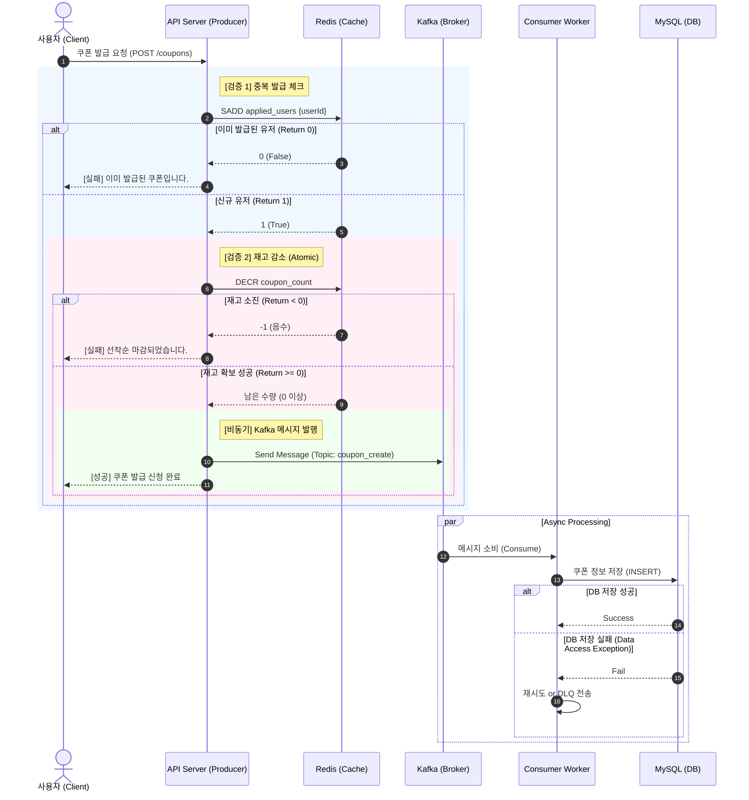

### 1. 시나리오 설계 (Business Logic)

서비스의 목표는 "정해진 시간에 한정된 수량의 쿠폰을 선착순으로 발급"하는 것입니다.

1.  **이벤트 오픈 전:** 사용자는 쿠폰 발급 요청을 보낼 수 없거나, 요청 시 "준비 중" 메시지를 받습니다.
2.  **이벤트 시작:** 수만 명 이상의 사용자가 동시에 발급 버튼을 클릭합니다.
3.  **검증 로직:**
    * 사용자가 이미 발급받았는지 확인합니다. (1인 1매 제한)
    * 남은 쿠폰 수량이 있는지 확인합니다.
4.  **발급 처리:**
    * 검증 통과 시, 사용자에게 즉시 "발급 신청이 완료되었습니다"라고 응답합니다. (Non-blocking)
    * 실제 DB 적재는 비동기로 처리됩니다.
5.  **이벤트 종료:** 수량이 소진되면 이후 요청은 즉시 "마감되었습니다"라고 거절합니다.


### 2. 아키텍처 구조

요청을 처리하는 API와 실제 데이터를 처리하는 메시지 브로커를 분리하여 결합도를 낮춥니다.



### 3. 기술 스택 및 사용 이유

| 기술 스택 | 역할 | 사용 이유 및 핵심 가치                                                |
| :--- | :--- |:-------------------------------------------------------------|
| **Kotlin & Spring Boot** | 웹 프레임워크 | 간결한 문법, Null Safety로 안정성 확보, 방대한 생태계 지원.                     |
| **Apache Kafka** | 메시지 브로커 | DB가 감당할 수 없는 대용량 트래픽을 큐에 담아두고, DB가 처리 가능한 속도로 조절하여 서버 다운 방지. |
| **MySQL** | RDBMS | 데이터의 영속성 보장. 최종적인 쿠폰 발급 이력 저장.                               |
| **Spring Data JPA** | ORM | 객체 지향적인 데이터 접근, 비즈니스 로직 구현 용이.                               |

### 4. 주요 고려 사항 (Key Considerations)

1.  **동시성 제어 (Concurrency Control):**
    * 수천 명이 동시에 요청할 때 정확히 100개만 발급되어야 합니다. Java의 `synchronized`는 서버가 여러 대일 경우 무용지물이므로, \*\*Redis의 `INCR/DECR`\*\*이나 **Lua Script**를 사용하여 원자성(Atomicity)을 보장해야 합니다.
2.  **중복 발급 방지 (Idempotency):**
    * 따닥(Double Click) 방지 및 부정 사용자 필터링을 위해 User ID를 Key로 하여 중복 여부를 체크해야 합니다. Redis `Set` 자료구조가 적합합니다.
3.  **데이터 정합성 (Consistency):**
    * Redis에서는 수량을 깎았는데, Kafka 전송에 실패하거나 Consumer가 DB에 넣다가 에러가 나면? -\> 실제 DB 데이터와 Redis 카운트가 불일치하는 문제가 발생합니다.


### 5. 예상되는 문제 상황

#### 문제 1: 타임아웃 이슈

* **상황:** Kafka가 순간적으로 느려지거나 네트워크 이슈로 `Producer.send()`가 타임아웃이 발생하면, 고객은 "실패" 응답을 받지만 Redis 수량은 이미 차감된 상태일 수 있습니다.
* **해결:** 트랜잭션 롤백처럼, Kafka 전송 실패 `catch` 블록에서 수량을 다시 복구해주는 보상 트랜잭션 로직이 필요합니다.

## 6. 해결 과정
### 순정 MySQL 사용
Spring Boot와 MySQL만을 사용하여 동시성 테스트를 진행해보려고 한다.
쿠폰 생성 수가 100을 넘게되면(100명에게 쿠폰이 발급되면), 쿠폰을 더 이상 발급하지 않도록 Service를 작성했다.
이 경우 1000명의 사용자가 쿠폰 발급을 동시에 수행할 경, 어떻게 될까?


당연히 100장이 아닌 107장이라는 결과가 발생했다.
이를 경쟁 상태라고 하며, 특히 'Check-Then-Act' 패턴의 한계 때문에 발생한다.
예를 들어 99장의 쿠폰이 발급된 상황에 2명의 사용자 A, B가 발생한다고 가정해보자.
A가 Check를 하여 마지막 한 장의 쿠폰이 남았다는 것을 확인하고 쿠폰을 생성한다.
생성된 쿠폰을 저장하기 전에, B가 Check를 하면 입장에서도 마지막 한 장의 쿠폰이 남았다는 것으로 확인하게 된다.
따라서, A, B 모두 쿠폰을 발급하게 되어 100장을 초과하는 쿠폰이 발급되게 된다.

이를 해결하기 위해선 Check와 Act를 하나의 트랜잭션으로 처리해야 한다.

### synchronized 사용
단순하게 Check와 Act를 하나의 트랜잭션으로 처리하도록 락을 걸면되는 거 아닌가?라고 생각했다.
따라서, Synchronized를 이용하여 같은 테스트를 실행해보았다.
```kotlin
@Synchronized
fun issue(userId: Long) {
    val count = couponRepository.count()

    if(count < 100) {
        couponRepository.save(Coupon(userId = userId, issuedDate = LocalDateTime.now()))
    } else {
        throw IllegalStateException("마감되었습니다.")
    }
}
```


정확하게 100개의 쿠폰을 발급할 수 있었다. 그런데 이를 사용할 경우 발생하는 단점도 있지 않을까 고민해보았다.
Synchronized는 JVM 단위 lock이어서 해당 서버 프로세스 내에서만 동작한다.
만약 서비스가 여러 서버로 분산되어 있거나, 여러 WAS 인스턴스가 뜬 경우에는 각 JVM에서 각각 쿠폰을 발급할 수 있어서 여전히 100장을 초과해 발급될 수 있다.
뿐만 아니라, DB에 여러 커넥션이 접속해 있는 경우 DB에서의 동시성 충돌이 발생할 수 있다.

### 비관적 락 적용
비관적 락은 데이터를 읽을 때 즉시 데이터베이스 테이블 or 레코드에 락을 설정한다.
따라서 다른 트랜잭션이 해당 데이터를 읽거나 수정되어 락키를 획득 할때까지 대기한다.

> - 공유 락: 데이터를 읽을 때 사용되며, 다른 트랜잭션도 해당 데이터를 읽기 가능
> - 배타 락: 데이터를 수정할 때 사용되며, 해당 데이터에 대한 다른 트랜잭션의 접근을 차단

JPA에서 제공하는 @Lock 어노테이션을 이용하여 손쉽게 비관적 락 적용이 가능하다.
```kotlin
interface CouponRepository : JpaRepository<Coupon, Long> {
    // 이 쿼리를 실행하는 동안, 다른 트랜잭션은 읽기도 쓰기도 못하게 함
    @Lock(LockModeType.PESSIMISTIC_WRITE)
    @Query("select count(c) from Coupon c")
    fun countWithLock(): Long
}
```
비관적 락을 적용했음에도 쿠폰은 100개 이상 발급되는 문제는 여전했다.
`SELECT count(*) FROM coupons;`를 이용한 재고 관리는 문제가 있다.

count 쿼리에 비관적 락을 걸어도 해당 Coupon 테이블 전체 row에 락이 걸리는 것이 아니라, count 결과를 가져올 때만 잠깐 락이 걸린다.
즉, `select count(c) from Coupon`는 Coupon 엔티티 자체 row에 락이 걸리는 게 아니라, 단순히 집계만 하고 바로 커밋된다.
이후에 쿠폰을 발급할 때, 이미 count 조회 이후 잠깐의 사이에 다른 트랜잭션에서 쿠폰이 추가될 수 있다.
결과적으로 여러 사용자가 거의 동시에 해당 함수(issueWithLock)를 실행하면, count가 100 미만으로 보이는 경우가 여러 번 발생하여 100장을 초과해서 발급될 수 있다.

### 개수 관리 엔티티 사용
그렇다면 직접 count 쿼리로 개수를 세는 것 보다 쿠폰 개수를 별도의 엔티티로 관리하는 방식을 통해 해결할 수 있을 것이라고 생각했다.
개수 관리 엔티티를 통해 별도 row로 atomic하게 관리할 수 있다.


| 항목         | 측정값           | 분석                      |
| ---------- | ------------- |-------------------------|
| # Samples  | 3000          | 총 3000건 요청              |
| Average    | 815ms         | 평균 응답시간: 양호 수준(1초 이내)   |
| Min/Max    | 14ms / 2731ms | 최소/최대 응답시간, 일부 요청 대기 발생 |
| Std. Dev.  | 498.77ms      | 편차가 커서 대기발생 가능성 있음      |
| Error %    | 96.67%        | 200이 아닌 응답 (정상)         |
| Throughput | 18.7/sec      | 초당 실제 처리량 매우 낮음         |

처리량이 18.7/sec으로 매우 낮은 값으로, 단일 row 락 방식의 병목이 발생했다.
또한, Max 응답 시간이 2731ms로 일부 요청에 대해서는 심각한 병목이 발생하는 것을 발견했다.
현 구조(비관적 락, 단일 row 관리)는 대량 트래픽이나 이벤트 환경에서는 실제 운영에 한계가 있다.
TPS 극저조, 오류율 폭증은 병목/락 대기가 매우 심각하기 때문에 이를 해결할 방안이 필요하다.

생각해볼 수 있는 해결 방법으로는 분산 카운터, 비동기 큐/캐시 활용, 쿠폰 데이터 사전 생성 방식 등이 있다.

### 대기열 처리
사용자 관점에서 어떻게하면 가장 납득할만한 분산 처리를 수행할 수 있을지 고민해보았다.
우리가 티켓팅 시에 보게되는 대기열을 사용하는 것에 대한 아이디어를 떠올렸다.

- 대기열 처리 방식의 장점
    - DB 락 경쟁 없이, 순차적으로 처리가 가능하다.
    - 클라이언트 요청을 바로 DB에 반영하지 않고 대기열에 넣기에 DB 부하가 덜 해진다.
    - 스케일 아웃 시, 모두가 동시에 한 큐로 요청을 집어넣으면 되기에 병렬 처리 가능하다.

- 주요 구현 패턴
  - 비동기 메시지 큐(Kafka, RabbitMQ, Redis List 등)을 도입

발급 로직은 "요청 → 큐"로 저장,

“큐 → Consumer”에서 DB/쿠폰 row 실제 발급

한도 초과 시 큐에서 바로 예외 및 알림 반환

요청 기록/이벤트 로그 등도 함께 남길 수 있다.

사용 사례
실제로 네이버, 카카오 등 대규모 이벤트 트래픽에서 "Request Queue → Worker" 구조를 도입해 병목을 해결함.​​
